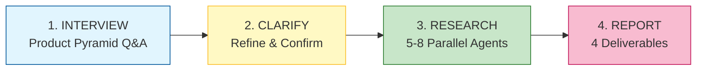
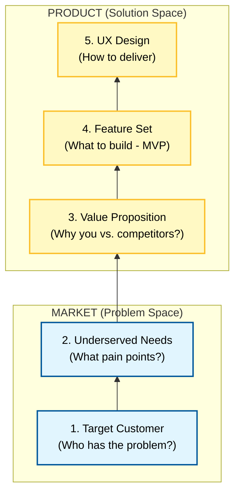

# Product-Discovery Skill

Validate product ideas using **Lean Product Playbook** methodology before building. This skill acts as a Super PM to guide you through the Product-Market Fit Pyramid, conduct comprehensive research, and deliver actionable validation reports.

## Mission

Help you answer the critical question: **"Should I build this?"**

By the end of this process, you will have:
1. Crystal-clear understanding of your target customer and their pain points
2. Research-backed market and technical feasibility assessment
3. Product-Market Fit scorecard across 4 dimensions
4. Detailed action plan for validation and MVP development

## Workflow Overview



**Total time**: 15-25 minutes for comprehensive validation

## The Product-Market Fit Pyramid

This skill guides you through Dan Olsen's 5-layer framework:



## Phase 1: INTERVIEW (Conversational)

Uses conversational, adaptive questioning to explore:

### Target Customer (Who?)
- Customer segments & personas
- Demographics, psychographics, behaviors
- Current pain points and workarounds

### Underserved Needs (What problem?)
- Importance vs. Satisfaction framework
- Identifying "opportunity gaps"
- Priority pain points

### Value Proposition (Why you?)
- Kano Model (Must-haves, Performance, Delighters)
- Competitive differentiation
- Unique positioning

### Feature Set (What to build?)
- MVP scope definition
- Must-have vs. nice-to-have features
- ROI prioritization

**Interview Style**: Conversational and adaptive - questions adjust based on your answers, like a real PM conversation.

## Phase 2: CLARIFY

- Synthesize interview responses
- Identify ambiguities or gaps
- Confirm understanding with you
- Prepare research hypotheses

## Phase 3: RESEARCH (Deep Mode)

Spawns **5-8 parallel research agents** to validate your idea:

### Core Research Agents

1. **market-researcher**
   - TAM/SAM/SOM sizing
   - Market dynamics and trends
   - Competitive landscape analysis

2. **tech-researcher**
   - Technical feasibility assessment
   - Complexity and risk analysis
   - Technology maturity evaluation

3. **content-researcher**
   - Similar product case studies
   - Success/failure patterns
   - Best practices and lessons learned

4. **financial-researcher** (if applicable)
   - Business model viability
   - Revenue potential
   - Unit economics assessment

5. **team-researcher** (if applicable)
   - Target customer insights and research
   - User behavior patterns
   - Persona validation

### Quality Assurance

6. **quality-reviewer**
   - Gap analysis across research
   - Contradiction detection
   - Follow-up questions generation

7. **synthesizer**
   - Consolidate all findings
   - Apply Lean Product lens
   - Generate unified insights

**Research Time**: 10-15 minutes for comprehensive coverage

## Phase 4: REPORT (4 Deliverables)

### 1. Research Report
Consolidated findings from all agents:
- Market Analysis
- Technical Feasibility
- Case Studies & Learnings
- Target Customer Insights

### 2. Feasibility Assessment
Go/No-Go recommendation based on:
- Problem-Solution Fit
- Market Opportunity
- Technical Risk
- Overall Readiness

**Ratings**: 🟢 Go | 🟡 Proceed with Caution | 🔴 No-Go

### 3. Product-Market Fit Scorecard

Scored across **4 critical dimensions**:

| Dimension | Weight | Description |
|-----------|--------|-------------|
| **Problem Clarity** | 30% | How well-defined is the customer pain point? |
| **Market Size** | 25% | Is the addressable market large enough? |
| **Solution Uniqueness** | 25% | Is your solution differentiated? |
| **Technical Feasibility** | 20% | Can this be built within constraints? |

**Overall PMF Score**: 0-100 (weighted average)
- 80-100: Strong PMF potential
- 60-79: Moderate PMF potential (requires iteration)
- 40-59: Weak PMF (significant pivots needed)
- 0-39: Poor PMF (reconsider direction)

### 4. Action Plan (Detailed Step-by-Step)

Based on Lean Product Playbook methodology:

**Immediate Next Steps** (Week 1-2):
- Customer interview plan
- Prototype/wireframe creation
- Testing recruitment

**Validation Phase** (Week 3-6):
- User testing protocols
- Metrics to track
- Success criteria

**MVP Development** (Month 2-3):
- Feature prioritization
- Build roadmap
- Launch strategy

## Workspace Structure

All outputs saved to timestamped workspace:

```
/research/product-ideas/MMDD-<idea-slug>-YY/
├── raw/
│   ├── agent-market-researcher.md
│   ├── agent-tech-researcher.md
│   ├── agent-content-researcher.md
│   ├── agent-financial-researcher.md (if applicable)
│   ├── agent-team-researcher.md (if applicable)
│   ├── agent-quality-reviewer.md
│   └── agent-synthesizer.md
├── interview-transcript.md        # Phase 1 output
├── research-report.md             # Phase 4.1
├── feasibility-assessment.md      # Phase 4.2
├── pmf-scorecard.md               # Phase 4.3
└── action-plan.md                 # Phase 4.4
```

## Key Principles

1. **Problem Space Before Solution Space**
   - Understand the pain before designing the cure

2. **Research-Backed Decisions**
   - No guesswork - validate with data

3. **Lean Methodology**
   - Build → Measure → Learn cycles
   - Fail fast, iterate faster

4. **Customer-Centric**
   - Your assumptions ≠ customer reality
   - Listen, observe, validate

## How to Use This Skill

Simply invoke the skill - no arguments needed:
```
> Use Product-Discovery skill
```

The skill will:
1. Start with conversational interview
2. Automatically spawn research agents
3. Generate all 4 reports
4. Save to workspace

**No configuration required** - the skill guides you through the entire process.

## Success Criteria

By the end, you should be able to answer:
- ✅ Who is my target customer? (Specific persona)
- ✅ What is their biggest pain point? (Underserved need)
- ✅ Why will they choose me? (Value proposition)
- ✅ What should I build first? (MVP features)
- ✅ Is this idea worth pursuing? (Go/No-Go)

## References

- Workflow orchestrator: `workflows/orchestrator.md`
- Interview guide: `shared/interview-guide.md`
- PMF scorecard: `shared/pmf-scorecard.md`
- Agent selection: `shared/agent-selection.md`
- Output templates: `shared/output-templates.md`

---

**Remember**: "The goal of a startup is not to build a product. It's to learn how to build a sustainable business." — Eric Ries
